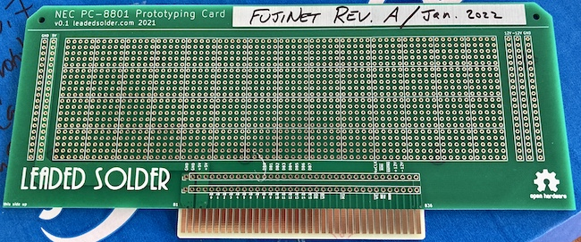
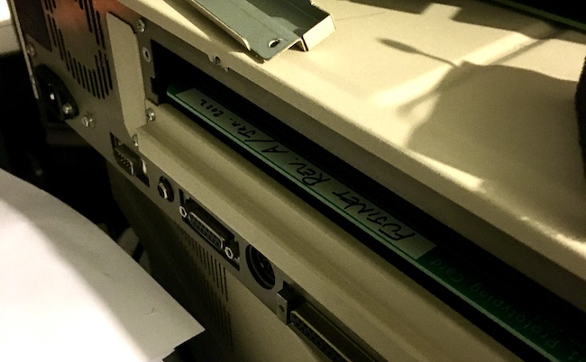

# NEC PC-8801 expansion protoboard
This board is meant to be a prototyping board for creating expansion cards for the NEC PC-8801 series of Japanese-market personal computers. It is intended to be a substitute for the Sunhayato MCC-151 prototyping board, which is (as far as I know) no longer available for purchase.

This board was developed as part of a [leaded solder](https://www.leadedsolder.com) web log entry. If it saved you some time or money, [please consider backing the site on Patreon](https://www.patreon.com/leadedsolder).

## Bill of Materials (Optional)
The card itself is enough for most users, but you may wish to add a card ejector in order to make it easier to insert and remove the card while you are prototyping your circuit.

I have tested it with the common and still-available Bivar CP-26 series. Installing the roll pins for the ejector lever is somewhat challenging for me, so I would appreciate any advice on how to make it faster and more consistent!
